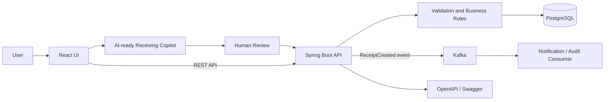

# Inventory Receipt Platform

A full-stack inventory receipt and inter-organization transfer application built
with React, Java Spring Boot.

## Features
- Search inventory items
- Group fictional items into recognizable product categories
- Create and validate receipt lines
- Prevent invalid quantities and duplicate serial numbers
- Persist receipts and receipt lines
- Publish receipt-created events through Kafka
- View receipt status and audit history
- Create inventory transfer orders between fictional organizations
- View and edit every transfer request in an inline-editable table
- Prevent same-organization transfers, unavailable quantities, and stale edits
- Analyze synthetic supplier shipment lines in an AI-ready receiving copilot
- Match supplier descriptions to internal items with visible confidence
- Detect quantity, product-match, and serial-number exceptions
- Propose editable serial assignments without autonomous inventory writes
- Require human review and Spring validation before persistence

## Tech Stack
React | Java | Spring Boot | Spring Data JPA | PostgreSQL | Kafka | Docker | JUnit | Mockito

## Architecture



## Screenshots

### Item search and results


### Receipt validation


### Receipt confirmation and status


## API endpoints

| Method | Endpoint | Purpose |
| --- | --- | --- |
| `GET` | `/api/items?query=scanner` | Search items by SKU or name |
| `POST` | `/api/copilot/receiving/analyze` | Match supplier lines, explain exceptions, and propose serial assignments |
| `POST` | `/api/receipts` | Validate and create an inventory receipt |
| `GET` | `/api/receipts/{id}` | Read receipt status, lines, and audit history |
| `GET` | `/api/inventory-organizations` | List valid source and destination organizations |
| `GET` | `/api/transfer-orders` | List every transfer request for the editable table |
| `POST` | `/api/transfer-orders` | Create a transfer order between two organizations |
| `PUT` | `/api/transfer-orders/{id}` | Validate and save one edited transfer-order row |

Example request:

```json
{
  "supplierName": "Northwind Industrial Supply",
  "lines": [
    {
      "itemId": 1,
      "quantity": 2,
      "serialNumbers": ["SCN-B2409-01", "SCN-B2409-02"]
    }
  ]
}
```


## Project structure

```text
inventory-receipt-platform/
├── frontend/                 React + Vite user interface
├── backend/                  Spring Boot REST API
│   └── src/main/
│       ├── java/             API, service, repository, domain, Kafka
│       └── resources/db/     Versioned Flyway migrations
├── docker-compose.yml        Frontend, API, PostgreSQL, and Kafka
└── .github/workflows/ci.yml  Backend tests and frontend build
```
