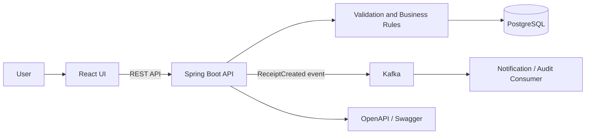

# Inventory Receipt Platform

A full-stack inventory-receipt application built with React, Java Spring Boot,
PostgreSQL, Kafka, and Docker.

## Features
- Search inventory items
- Group fictional items into recognizable product categories
- Create and validate receipt lines
- Prevent invalid quantities and duplicate serial numbers
- Persist receipts and receipt lines
- Publish receipt-created events through Kafka
- View receipt status and audit history

## Tech Stack
React | Java | Spring Boot | Spring Data JPA | PostgreSQL | Kafka | Docker | JUnit | Mockito

## Architecture



## Run locally
```bash
docker compose up --build
```

Open the React application at [http://localhost:3000](http://localhost:3000) and
Swagger UI at [http://localhost:8080/swagger-ui.html](http://localhost:8080/swagger-ui.html).

## Screenshots

### Item search and results


### Receipt validation


### Receipt confirmation and status


### Kafka event monitor


## API endpoints

| Method | Endpoint | Purpose |
| --- | --- | --- |
| `GET` | `/api/items?query=scanner` | Search items by SKU or name |
| `POST` | `/api/receipts` | Validate and create an inventory receipt |
| `GET` | `/api/receipts/{id}` | Read receipt status, lines, and audit history |

Example request:

```json
{
  "supplierName": "Northwind Industrial Supply",
  "lines": [
    {
      "itemId": 1,
      "quantity": 8,
      "serialNumber": "SCN-B2409-01"
    }
  ]
}
```

Successful creation persists the receipt and publishes a `ReceiptCreated` JSON
event to the three-partition `receipt-created` Kafka topic. The included
`ReceiptAuditConsumer` consumes the same event and writes a structured audit log.

## Validation rules

- A supplier and at least one receipt line are required.
- Quantities must be between 1 and 10,000 units.
- Non-empty serial numbers must be unique within a receipt (case-insensitive).
- Every item identifier must reference an existing inventory item.
- API errors use a consistent code, message, details, and timestamp structure.

## Tests

The backend service layer is unit-tested with JUnit 5, Mockito, and AssertJ. The
tests cover successful persistence/event publishing, normalized item search,
duplicate serial rejection, and missing inventory items.

```bash
cd backend
mvn test
```

Build the React client independently with:

```bash
cd frontend
npm install
npm run build
```

## Project structure

```text
inventory-receipt-platform/
├── frontend/                 React + Vite user interface
├── backend/                  Spring Boot REST API
│   └── src/main/
│       ├── java/             API, service, repository, domain, Kafka
│       └── resources/db/     Versioned Flyway migrations
├── docker-compose.yml        Frontend, API, PostgreSQL, and Kafka
└── .github/workflows/ci.yml  Backend tests and frontend build
```

## Design notes

This is a public, sanitized portfolio project. All item names, suppliers,
identifiers, quantities, and events are fictional; it contains no proprietary
code or production data. The Kafka publisher waits for broker acknowledgement so
the API never reports a published event before Kafka accepts it. In a
high-volume production system, the next evolution would be a transactional
outbox to atomically bridge PostgreSQL commits and Kafka delivery.

The sample catalog uses familiar, industry-neutral warehouse products and
invented identifiers. See [Sanitization and domain boundaries](docs/SANITIZATION.md)
for the rules used to keep the project safe for a public portfolio.

## Interview preparation

Read the [detailed code and interview guide](docs/INTERVIEW_GUIDE.md) for the
end-to-end request flow, file-by-file reasoning, design tradeoffs, testing
strategy, and suggested answers to common React, Spring, PostgreSQL, Kafka, and
Docker interview questions.

## License

[MIT](LICENSE)
