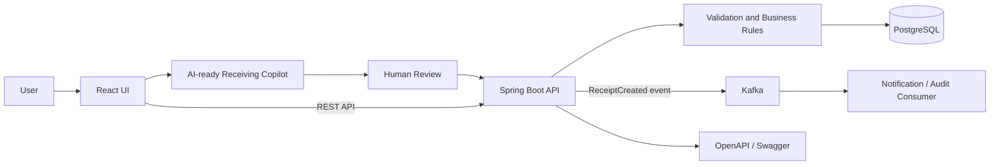
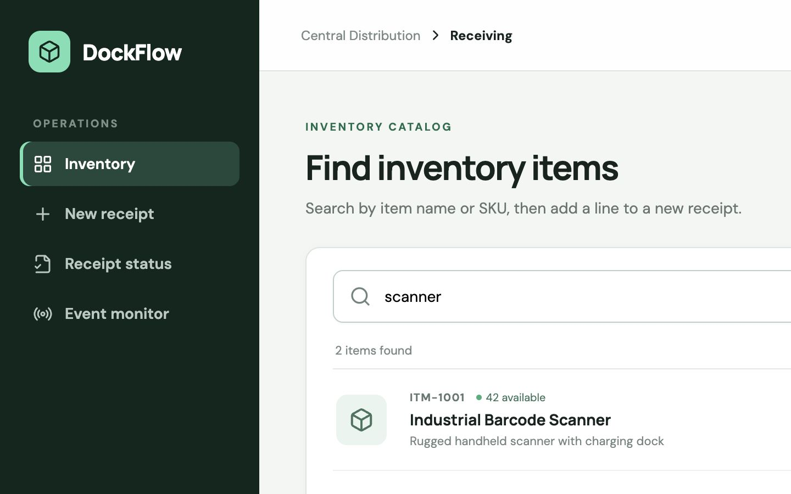
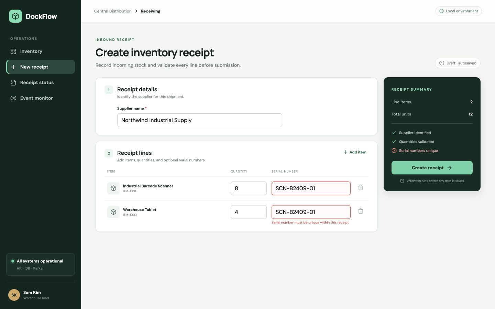
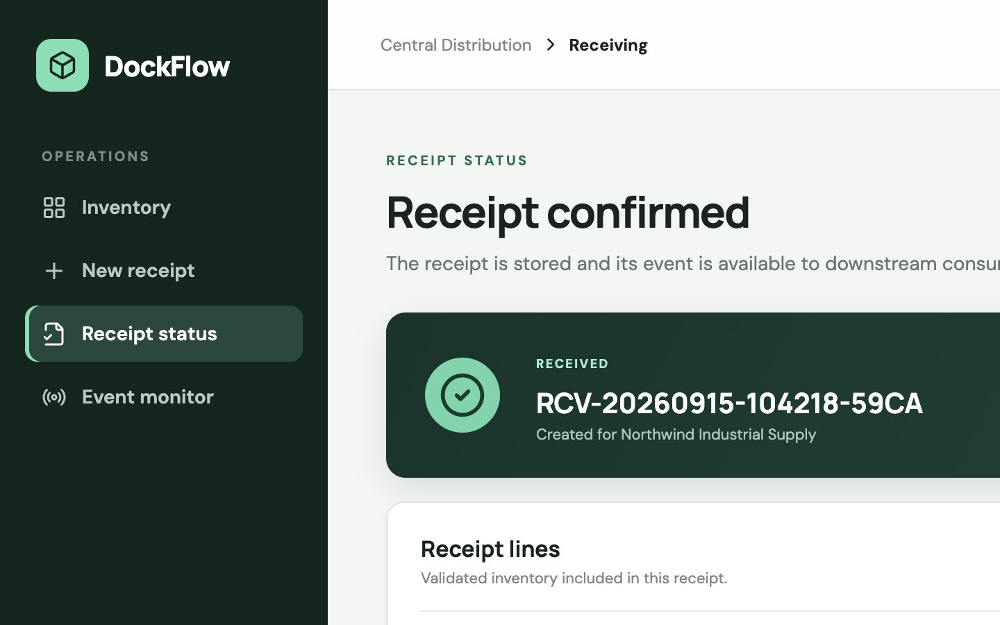
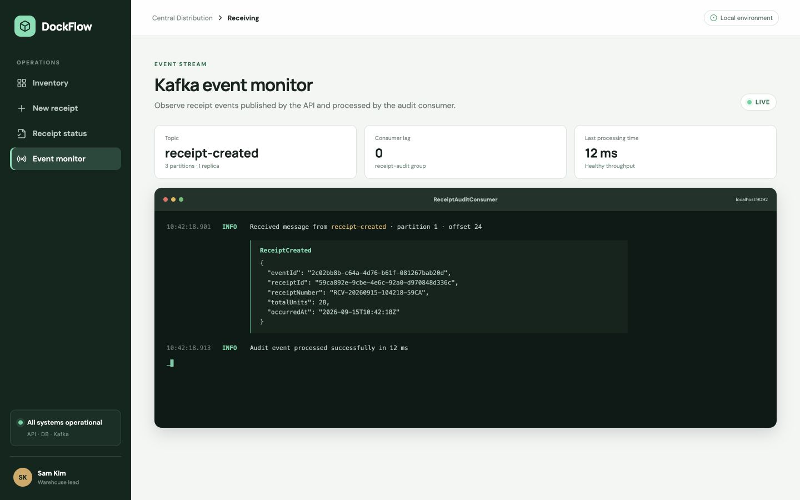

# Inventory Receipt Platform

A full-stack inventory receipt and inter-organization transfer application built
with React, Java Spring Boot.

## Features
- Search inventory items
- Group fictional items into recognizable product categories
- Create and validate receipt lines
- Prevent invalid quantities and duplicate serial numbers
- Persist receipts and receipt lines
- Publish receipt-created events through Kafka
- View receipt status and audit history
- Create inventory transfer orders between fictional organizations
- View and edit every transfer request in an inline-editable table
- Prevent same-organization transfers, unavailable quantities, and stale edits
- Analyze synthetic supplier shipment lines in an AI-ready receiving copilot
- Match supplier descriptions to internal items with visible confidence
- Detect quantity, product-match, and serial-number exceptions
- Propose editable serial assignments without autonomous inventory writes
- Require human review and Spring validation before persistence

## Tech Stack
React | Java | Spring Boot | Spring Data JPA | PostgreSQL | Kafka | Docker | JUnit | Mockito

## Architecture



## Screenshots

### Item search and results



### Receipt validation



### Receipt confirmation and status



### Kafka event monitor



## API endpoints

| Method | Endpoint | Purpose |
| --- | --- | --- |
| `GET` | `/api/items?query=scanner` | Search items by SKU or name |
| `POST` | `/api/copilot/receiving/analyze` | Match supplier lines, explain exceptions, and propose serial assignments |
| `POST` | `/api/receipts` | Validate and create an inventory receipt |
| `GET` | `/api/receipts/{id}` | Read receipt status, lines, and audit history |
| `GET` | `/api/inventory-organizations` | List valid source and destination organizations |
| `GET` | `/api/transfer-orders` | List every transfer request for the editable table |
| `POST` | `/api/transfer-orders` | Create a transfer order between two organizations |
| `PUT` | `/api/transfer-orders/{id}` | Validate and save one edited transfer-order row |

Example request:

```json
{
  "supplierName": "Northwind Industrial Supply",
  "lines": [
    {
      "itemId": 1,
      "quantity": 2,
      "serialNumbers": ["SCN-B2409-01", "SCN-B2409-02"]
    }
  ]
}
```

Successful creation persists the receipt and publishes a `ReceiptCreated` JSON
event to the three-partition `receipt-created` Kafka topic. The included
`ReceiptAuditConsumer` consumes the same event and writes a structured audit log.

## Validation rules

- A supplier and at least one receipt line are required.
- Quantities must be between 1 and 10,000 units.
- Non-empty serial numbers must be unique within a receipt (case-insensitive).
- Serial-controlled items require exactly one serial number per received unit.
- Non-serial-controlled items reject accidental serial assignments.
- A serial number already received on an earlier receipt cannot be reused.
- Every item identifier must reference an existing inventory item.
- Transfer source and destination organizations must be different.
- A transfer quantity cannot exceed the selected item's available inventory.
- Transfer needed-by dates cannot be in the past.
- Version checks reject stale table edits instead of silently overwriting them.
- API errors use a consistent code, message, details, and timestamp structure.

## Tests

The backend service layer is unit-tested with JUnit 5, Mockito, and AssertJ. The
tests cover successful persistence/event publishing, normalized item search,
per-unit serial policy, duplicate and previously received serial rejection,
copilot catalog matching, unknown products, missing serial behavior, transfer
creation and updates, invalid organization pairs, unavailable quantities, and
stale edits.

```bash
cd backend
mvn test
```

Build the React client independently with:

```bash
cd frontend
npm install
npm run build
```

## Project structure

```text
inventory-receipt-platform/
├── frontend/                 React + Vite user interface
├── backend/                  Spring Boot REST API
│   └── src/main/
│       ├── java/             API, service, repository, domain, Kafka
│       └── resources/db/     Versioned Flyway migrations
├── docker-compose.yml        Frontend, API, PostgreSQL, and Kafka
└── .github/workflows/ci.yml  Backend tests and frontend build
```

## Design notes

This is a public, sanitized portfolio project. All item names, suppliers,
identifiers, quantities, and events are fictional; it contains no proprietary
code or production data. The Kafka publisher waits for broker acknowledgement so
the API never reports a published event before Kafka accepts it. In a
high-volume production system, the next evolution would be a transactional
outbox to atomically bridge PostgreSQL commits and Kafka delivery.

The sample catalog and organizations use familiar, industry-neutral warehouse
concepts and invented identifiers. See
[Sanitization and domain boundaries](docs/SANITIZATION.md) for the rules used to
keep the project safe for a public portfolio.

### AI boundary

The included copilot runs with a deterministic `LOCAL_EXPLAINABLE` provider so
the repository is runnable without credentials and every recommendation can be
tested exactly. It demonstrates the agent workflow, tool contract, editable
review step, and safety controls; it does **not** claim that a generative model
or Oracle AI Agent Studio is currently connected. An approved agent can later
call the same REST endpoints as tools.

## Interview preparation

Read the [detailed code and interview guide](docs/INTERVIEW_GUIDE.md) for the
end-to-end request flow, file-by-file reasoning, design tradeoffs, testing
strategy, and suggested answers to common React, Spring, PostgreSQL, Kafka, and
Docker interview questions.

For the new assistant workflow, follow the
[AI copilot implementation and testing guide](docs/AI_COPILOT_GUIDE.md). It
explains the demo step by step, lists testable scenarios, and clearly separates
what this project proves from capabilities that require a real model, security
layer, or production inventory system.

## License

[MIT](LICENSE)
