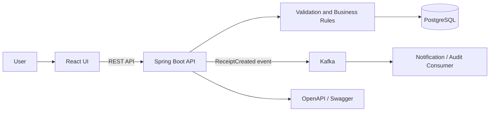

# Inventory Receipt Platform — Detailed Interview Guide

This guide explains how the project works, why each layer exists, and how to
describe the design in an interview. Read it once end to end, then practice the
short explanations near the end aloud.

## 1. The project in one sentence

The application lets a receiving user search a fictional product catalog, build
and validate an inbound inventory receipt, persist the receipt and its lines in
PostgreSQL, publish a `ReceiptCreated` event to Kafka, and view the resulting
status and audit trail in React.

The important phrase is **fictional product catalog**. The business concepts are
industry-standard; the implementation and data are original and sanitized.

## 2. The architecture at a glance



Each technology has one clear responsibility:

- **React** owns user interaction and immediate feedback.
- **Spring MVC** exposes HTTP endpoints and converts JSON to typed Java objects.
- **The service layer** owns application orchestration and business rules.
- **Spring Data JPA** translates repository operations into SQL.
- **PostgreSQL** provides durable relational storage and database constraints.
- **Kafka** distributes a fact—`ReceiptCreated`—to independent consumers.
- **Docker Compose** creates a repeatable local environment.
- **JUnit and Mockito** verify service behavior without requiring infrastructure.

That separation is worth emphasizing in interviews. It makes changes easier to
reason about, gives every layer a focused test surface, and prevents React or a
controller from becoming the home of core business rules.

## 3. Domain model: item, product category, receipt, and receipt line

### Item

[`Item.java`](../backend/src/main/java/com/portfolio/inventory/domain/Item.java)
represents one inventory master record.

- `id` is the internal database key. It is efficient for joins and is not shown
  as the business identifier.
- `sku` is the invented external item number, such as `ITM-1001`.
- `name` is the human-readable product name.
- `productCategory` groups related items, such as `Scanning & Mobility`.
- `description` helps the receiving user distinguish similar products.
- `availableQuantity` is a simplified availability value for the demo.

An interview distinction to make: **an item is the specific stock-keeping unit;
a product category is a broader grouping**. Two items can belong to the same
category while having different SKUs and inventory balances.

`@Entity` tells JPA that this class maps to a table. `@Table(name = "items")`
makes the mapping explicit. `@Id` identifies the primary key, and
`@GeneratedValue(strategy = IDENTITY)` lets PostgreSQL's identity sequence
generate it.

The no-argument constructor is `protected` because JPA needs it when materializing
rows, but application code should not construct an incomplete item accidentally.
The public constructor is useful in tests and controlled creation paths.

### Receipt

[`Receipt.java`](../backend/src/main/java/com/portfolio/inventory/domain/Receipt.java)
is the aggregate root for one inbound transaction.

- `id` is a UUID, making the identifier safe to generate in the application and
  hard to enumerate through the API.
- `receiptNumber` is a readable business reference.
- `supplierName` identifies the fictional source of the shipment.
- `status` is stored as a string enum rather than a fragile numeric ordinal.
- `createdAt` uses `Instant`, so the database stores an unambiguous UTC moment.
- `lines` contains the child records that belong to the receipt.

`@OneToMany(mappedBy = "receipt")` says the foreign key is owned by
`ReceiptLine.receipt`. `cascade = ALL` means saving the receipt also saves its
new lines. `orphanRemoval = true` would delete a line removed from the aggregate
if editing were later supported. `LAZY` avoids loading lines every time a receipt
header is queried.

The `addLine` method protects aggregate construction. The service tells the
receipt to add a line instead of separately saving unrelated `ReceiptLine`
objects. This keeps the parent-child link consistent in memory.

### Receipt line

[`ReceiptLine.java`](../backend/src/main/java/com/portfolio/inventory/domain/ReceiptLine.java)
connects a receipt to an item and records the received quantity and optional
serial number.

The two `@ManyToOne` relationships create foreign-key-backed references to the
receipt and item. Both are lazy because a line does not always need the full
parent or item record. `optional = false` reflects that a valid line cannot
exist without either reference.

The database adds a positive quantity check and a uniqueness constraint for a
non-null serial inside one receipt. The service also rejects duplicate serials
case-insensitively before reaching the database, producing a clearer API error.

This is defense in depth:

1. React catches mistakes early for a better user experience.
2. Bean Validation rejects structurally invalid API requests.
3. The service enforces cross-line business rules.
4. PostgreSQL protects data integrity if another code path is added later.

## 4. PostgreSQL and Flyway

[`V1__create_inventory_schema.sql`](../backend/src/main/resources/db/migration/V1__create_inventory_schema.sql)
creates the three core tables.

### `items`

The table keeps item master data. `sku` is unique because two database rows must
not represent the same business item number. `available_quantity >= 0` prevents
impossible negative availability in this simplified model.

### `receipts`

The UUID is supplied by Java. `receipt_number` is separately unique because it
is the user-facing reference. `TIMESTAMPTZ` stores a time-zone-aware instant.

### `receipt_lines`

`receipt_id` and `item_id` are foreign keys. These constraints prevent orphaned
lines and references to unknown items. `quantity > 0` provides a final database
safety net. The receipt ID index speeds up loading every line for one receipt.

[`V2__seed_demo_items.sql`](../backend/src/main/resources/db/migration/V2__seed_demo_items.sql)
loads only synthetic products. Flyway runs migrations in version order and
records completed versions in its schema history table. This makes database
creation deterministic across developer laptops and CI environments.

Why Flyway instead of `ddl-auto=create`? SQL migrations are reviewable,
versioned, reproducible, and safe to evolve. Hibernate is configured with
`ddl-auto: validate`, so startup fails if the entity mappings and migrated
schema disagree instead of silently modifying production tables.

## 5. Item search: full request path

### Step 1: React captures the query

`InventorySearch` in
[`App.jsx`](../frontend/src/App.jsx) owns `query`, `items`, `loading`, and `error`
state with `useState`.

When `query` changes, `useEffect` starts a short 180 ms timer. This acts as a
small debounce: rapid typing does not immediately issue one request per
keystroke. The cleanup function cancels the previous timer when the user types
again or the component unmounts.

### Step 2: the API client sends the request

[`api.js`](../frontend/src/api.js) calls:

```text
GET /api/items?query=scanner
```

`encodeURIComponent` prevents spaces and special characters from corrupting the
URL. A non-2xx response becomes an exception, which the component converts into
a visible error banner. Production mode always uses the REST endpoint. The
explicit `VITE_DEMO_MODE=true` path exists only to capture deterministic public
screenshots without infrastructure.

### Step 3: the controller accepts HTTP input

[`ItemController.java`](../backend/src/main/java/com/portfolio/inventory/api/ItemController.java)
maps `/api/items`. `@RequestParam(defaultValue = "")` supports both search and
initial catalog loading. The controller delegates immediately; it contains no
business or persistence logic.

### Step 4: the service normalizes and maps

[`ItemService.java`](../backend/src/main/java/com/portfolio/inventory/service/ItemService.java)
trims the query so a search for `" scanner "` behaves like `"scanner"`.
`@Transactional(readOnly = true)` documents that the operation cannot modify
state and lets the persistence provider apply read-oriented optimizations.

The service maps `Item` entities to `ItemResponse` records. Returning DTOs rather
than entities prevents accidental exposure of persistence internals and keeps
the public contract deliberate.

### Step 5: the repository generates the query

[`ItemRepository.java`](../backend/src/main/java/com/portfolio/inventory/repository/ItemRepository.java)
extends `JpaRepository`, gaining standard persistence methods. Its derived query
searches SKU, name, or product category without case sensitivity, orders results
by name, and limits the response to 20 records.

For a larger catalog, explain that you would replace the fixed top-20 method
with `Pageable`, return pagination metadata, and consider PostgreSQL trigram or
full-text indexes.

### Step 6: React renders the results

Each item row shows the SKU, category, availability, product name, description,
and an action. React's `key={item.id}` gives the reconciliation algorithm a
stable identity for each row. Clicking **Add to receipt** creates a draft line
and moves the user to the receipt form.

## 6. Receipt creation: full request path

### Step 1: React owns an editable draft

`CreateReceipt` keeps the supplier, lines, validation errors, submission state,
and API error in component state. Every quantity and serial input is controlled:
its displayed value comes from React state, and `onChange` updates that state.

`updateLine` uses `map` to create a new array and a new object only for the
edited line. React state should be treated as immutable; mutating the existing
array can prevent reliable rerenders and makes state history harder to reason
about.

### Step 2: client validation runs

Before sending JSON, the component checks:

- supplier is not blank;
- at least one line exists;
- every quantity is positive;
- normalized non-empty serial numbers are unique.

Normalization uses `trim().toLowerCase()` so `" ABC "` and `"abc"` are treated
as the same serial. Client validation is for speed and usability, not security;
any caller can bypass the browser, so the backend repeats authoritative checks.

### Step 3: the client sends JSON

`createReceipt` issues:

```text
POST /api/receipts
Content-Type: application/json
```

The payload contains `supplierName` and line objects with `itemId`, `quantity`,
and optional `serialNumber`. The UI sends item IDs instead of trusting product
names or prices supplied by the browser.

### Step 4: Spring deserializes and validates

[`ReceiptController.java`](../backend/src/main/java/com/portfolio/inventory/api/ReceiptController.java)
uses `@RequestBody` to deserialize JSON and `@Valid` to trigger Bean Validation.

[`CreateReceiptRequest.java`](../backend/src/main/java/com/portfolio/inventory/api/dto/CreateReceiptRequest.java)
requires a nonblank supplier and a nonempty list. `List<@Valid ...>` cascades
validation into every line.

[`CreateReceiptLineRequest.java`](../backend/src/main/java/com/portfolio/inventory/api/dto/CreateReceiptLineRequest.java)
requires an item ID, restricts quantity to 1–10,000, and caps serial length.
Java records are a good fit because request DTOs are immutable data carriers.

### Step 5: the service enforces cross-line rules

[`ReceiptService.java`](../backend/src/main/java/com/portfolio/inventory/service/ReceiptService.java)
starts with `validateUniqueSerialNumbers`. Bean Validation can validate one
field or one object easily, while uniqueness across the entire list belongs in
service logic.

The method uses a `HashSet`, so duplicate detection is O(n) average time rather
than comparing every line with every other line in O(n²).

### Step 6: identifiers and time are created

The service obtains `now` from an injected `Clock` and creates a UUID. Using a
`Clock` instead of calling `Instant.now()` everywhere makes time deterministic
in unit tests.

The readable receipt number combines UTC time with a short UUID fragment. The
UUID remains the real primary key; the readable number exists for operations
and support conversations.

### Step 7: item references are verified

For each request line, `itemRepository.findById` loads the authoritative item.
An unknown ID throws `ResourceNotFoundException`, which becomes HTTP 404. The
service never creates a line around an unverified client-supplied product.

### Step 8: the aggregate is persisted

The service constructs the receipt, calls `receipt.addLine` for each verified
item, and executes `saveAndFlush`. Cascading persists the lines with their
parent. `flush` forces SQL execution before event publication, exposing database
constraint failures during this operation.

`@Transactional` makes the service method one database unit of work. A runtime
exception marks the transaction for rollback.

### Step 9: a Kafka event is published

The service creates a
[`ReceiptCreatedEvent`](../backend/src/main/java/com/portfolio/inventory/event/ReceiptCreatedEvent.java)
containing an event ID, receipt identity, readable number, total units, and
timestamp. It does not send the entire JPA entity or sensitive supplier data.
That keeps the event contract small and reduces coupling.

[`ReceiptEventPublisher.java`](../backend/src/main/java/com/portfolio/inventory/service/ReceiptEventPublisher.java)
uses a typed `KafkaTemplate`. The receipt UUID is the Kafka message key, so all
events for the same receipt would route to the same partition and retain order.
The publisher waits up to five seconds for broker acknowledgement.

Be candid about the production tradeoff: a database transaction and Kafka send
are not automatically atomic. This portfolio waits for Kafka acknowledgement,
but a production design with stronger delivery guarantees would use a
transactional outbox, commit the receipt and outbox row together, then publish
the outbox asynchronously with retries and idempotency.

### Step 10: the API returns HTTP 201

The controller returns `ResponseEntity.created(...)`, producing status `201
Created`, a `Location` header, and the new receipt body. The response contains
header data, lines, total units, and a small lifecycle history.

### Step 11: React shows confirmation

On success, React stores the response and changes to `ReceiptStatus`. The status
screen renders the receipt reference, supplier, totals, lines, and audit entries.
No second transformation is necessary because the backend response is designed
for this use case.

## 7. Kafka configuration and consumer

[`KafkaConfig.java`](../backend/src/main/java/com/portfolio/inventory/config/KafkaConfig.java)
declares a `NewTopic` bean with three partitions and one replica. Three partitions
allow parallel processing by up to three consumers in the same group. One
replica is appropriate only for a single-broker local demo; production should
use multiple brokers and a higher replication factor.

[`application.yml`](../backend/src/main/resources/application.yml) configures:

- broker address from an environment variable;
- string keys and JSON event values;
- the `receipt-audit` consumer group;
- earliest offset behavior for a new local group;
- a restricted trusted package for JSON deserialization.

[`ReceiptAuditConsumer.java`](../backend/src/main/java/com/portfolio/inventory/event/ReceiptAuditConsumer.java)
uses `@KafkaListener`. Spring creates a listener container, subscribes it to the
topic, deserializes JSON into the event record, and calls `consume`. The current
consumer writes a structured audit log.

In production you would discuss retry topics, a dead-letter topic, metrics,
idempotent consumption keyed by `eventId`, and a persistent audit store.

## 8. Error handling

[`ApiExceptionHandler.java`](../backend/src/main/java/com/portfolio/inventory/api/ApiExceptionHandler.java)
uses `@RestControllerAdvice` to turn exceptions into consistent JSON.

- Bean Validation failures become `400 VALIDATION_ERROR` with field details.
- Cross-line rule failures become `400 BUSINESS_RULE_VIOLATION`.
- Missing items or receipts become `404 NOT_FOUND`.

Central handling keeps controllers short and gives React one predictable error
shape. A production version would also add correlation IDs and a safe handler
for unexpected exceptions without exposing stack traces.

## 9. React component design

The portfolio keeps the UI in one main file so reviewers can follow it quickly,
but still separates behavior into components:

- `App` coordinates the active view and shared draft/receipt state.
- `Sidebar` and `Topbar` provide navigation and environment context.
- `InventorySearch` handles query lifecycle and results.
- `CreateReceipt` owns form state and validation.
- `ReceiptStatus` shows the completed aggregate and audit history.
- `EventMonitor` visualizes the event payload and consumer activity.
- `Metric` and `PageHeader` are small reusable presentation components.

The next refactor for a growing product would introduce React Router, a server
state library such as TanStack Query, form helpers, component-level tests, and
separate feature folders. Mentioning that shows you understand both why this
size is readable now and where its scaling boundary lies.

## 10. Docker Compose: how local startup works

[`docker-compose.yml`](../docker-compose.yml) defines four services.

### PostgreSQL

Environment variables create the local database and user. A named volume keeps
data across container restarts. The health check runs `pg_isready`.

### Kafka

Kafka runs in KRaft mode, so the demo does not need ZooKeeper. The broker and
controller roles share the single local node. Plaintext listeners are acceptable
only for local development.

### Backend

[`backend/Dockerfile`](../backend/Dockerfile) is multi-stage. Maven and the JDK
exist only in the build image. The runtime image contains a smaller Java runtime
and the packaged JAR. Compose injects service names—`postgres` and `kafka`—into
connection URLs. Docker's internal DNS resolves those names.

`depends_on` waits for database and broker health before starting the API. This
reduces startup races but does not replace application retry logic in production.

### Frontend

[`frontend/Dockerfile`](../frontend/Dockerfile) builds static React assets with
Node, then copies only `dist` into Nginx. The final image does not include npm or
source tooling.

[`nginx.conf`](../frontend/nginx.conf) serves the single-page application and
proxies `/api/` to `backend:8080`. `try_files ... /index.html` supports client-side
routes without returning 404 from Nginx.

## 11. Unit tests: what each test proves

[`ReceiptServiceTest.java`](../backend/src/test/java/com/portfolio/inventory/service/ReceiptServiceTest.java)
uses the Mockito JUnit extension to create repository and publisher mocks.

### Successful creation

The test stubs item lookup and makes `saveAndFlush` return its argument. It then
asserts the readable number, units, and line count. `ArgumentCaptor` inspects the
actual event passed to the publisher and verifies that the event receipt ID and
total match the saved response.

This proves orchestration, not just the return value.

### Duplicate serial rejection

The test supplies serials with different case and whitespace. It expects
`BusinessValidationException` and verifies that neither persistence nor Kafka
was called. This checks both the rule and the absence of side effects.

### Unknown item rejection

The repository returns `Optional.empty`. The test expects a precise not-found
exception and verifies that no event is published.

[`ItemServiceTest.java`](../backend/src/test/java/com/portfolio/inventory/service/ItemServiceTest.java)
verifies whitespace normalization, repository arguments, and entity-to-DTO
mapping including the product category.

Mocks are appropriate here because these are fast service-unit tests. For more
confidence, add Testcontainers integration tests with real PostgreSQL and Kafka,
plus MockMvc contract tests for HTTP status and JSON shapes.

## 12. CI workflow

[`ci.yml`](../.github/workflows/ci.yml) runs two independent jobs on pushes and
pull requests.

- The backend job installs Java 17, caches Maven artifacts, and runs tests.
- The frontend job installs Node 22, uses `npm ci` for lockfile-reproducible
  dependencies, and creates a production build.

Separate jobs fail independently and can run in parallel. `npm ci` is preferable
to `npm install` in CI because it enforces the exact lockfile.

## 13. A safe way to connect this project to enterprise SCM experience

Say:

> My enterprise SCM experience taught me the business importance of clean item
> identification, receipt validation, traceability, and reliable downstream
> integration. I applied those general lessons to a new vendor-neutral system.
> I designed the React UI, REST contract, Java services, PostgreSQL schema, and
> Kafka event independently, using entirely fictional data.

Do not discuss an employer's real product names, item-number formats, table
names, message schemas, screen layouts, customer volumes, incidents, or internal
architecture. The goal is to demonstrate your reasoning, not recreate a prior
system.

## 14. Two-minute interview walkthrough

> I built an inventory receipt platform with React and Spring Boot. A user can
> search a fictional item catalog by SKU, product name, or category, add receipt
> lines, and submit them with quantity and serial validation. Users can also
> create inventory transfer requests between fictional organizations and edit
> all request fields inline in a table. React performs
> immediate validation, while the backend repeats authoritative validation using
> Bean Validation and service-layer rules. The service verifies item IDs, builds
> a receipt aggregate, and persists the receipt and lines through JPA to
> PostgreSQL. After persistence it publishes a small ReceiptCreated event to
> Kafka using the receipt ID as the message key. An audit consumer processes the
> event, and the UI shows confirmation and lifecycle history. Docker Compose
> starts React, Spring Boot, PostgreSQL, and Kafka together. I tested service
> behavior with JUnit and Mockito, including failure paths and verifying that
> invalid receipts cause no persistence or event side effects. Transfer service
> tests cover invalid organization pairs, unavailable inventory, valid row
> updates, and stale-edit detection. All catalog data, organization data,
> identifiers, and contracts are fictional and sanitized.

## 15. Common interview questions and strong answers

### Why have a service layer?

Controllers should translate HTTP concerns, repositories should translate
persistence concerns, and services should coordinate business use cases. This
keeps rules reusable if another entry point—such as a batch job—is added and
makes unit testing straightforward.

### Why validate in both React and Java?

React validation improves responsiveness, but clients cannot be trusted. The
backend is the security and integrity boundary, and the database provides a
final constraint layer.

### Why use DTO records instead of returning entities?

DTOs prevent lazy-loading surprises, recursion through relationships, accidental
field exposure, and coupling the public API to database structure. Records make
immutable contracts concise.

### Why UUID for receipt ID and a second receipt number?

The UUID is globally unique and difficult to enumerate. The formatted receipt
number is easier for humans to read. Keeping both separates technical identity
from operational reference.

### Why key Kafka events by receipt ID?

Kafka guarantees order within a partition. The same key sends events for one
receipt to the same partition, preserving per-receipt order while allowing other
receipts to process in parallel.

### What happens if PostgreSQL succeeds and Kafka fails?

That boundary needs careful design. The demo waits for broker acknowledgement
and lets failure abort the service transaction, but it is not a complete atomic
guarantee across systems. A production implementation should use a transactional
outbox with retrying, idempotent publication and consumption.

### How would you handle duplicate API submissions?

Accept an idempotency key, store it with a uniqueness constraint, and return the
original result for retries. Consumers should also record `eventId` values so a
redelivered event does not repeat side effects.

### How would you scale item search?

Add pagination, appropriate lower/trigram/full-text indexes, query monitoring,
and possibly a dedicated search engine only when catalog size and requirements
justify it. Cache stable reference data carefully and invalidate on item changes.

### How would you secure the application?

Use an identity provider with OAuth 2.0/OIDC, authorize receiving roles in the
API, apply TLS, keep secrets outside Compose files, validate input, restrict CORS,
rate-limit sensitive endpoints, scan dependencies and images, and record audit
events without sensitive payloads.

### What would you build next?

The strongest next steps are transactional outbox delivery, idempotent receipt
and transfer creation, Testcontainers integration tests, persistent audit
events, pagination, authentication/authorization, and observability. Transfer
orders already demonstrate optimistic locking for editable rows.

## 16. Practice checklist

Before an interview, make sure you can explain without reading:

- the six boxes in the architecture diagram;
- the difference between an item, product category, receipt, and receipt line;
- the entire POST request from React click to Kafka consumer;
- why validation appears in three layers;
- what `@Transactional`, cascade, lazy loading, and `@EntityGraph` do;
- why the event key is the receipt UUID;
- the database/Kafka consistency limitation and outbox solution;
- what every unit test proves, including verified absence of side effects;
- how Compose service names become network hostnames;
- exactly how the portfolio is sanitized.
- how transfer creation, table editing, version checks, and HTTP 409 work.

Finally, practice drawing the architecture from memory in under one minute and
delivering the two-minute walkthrough in your own words. Interviewers respond
better to a clear causal story than a list of technologies.

## 17. Transfer orders: create and editable-table request flow

This extension demonstrates an inter-organization inventory movement without
copying any employer-specific order model. Each sample transfer request moves
one fictional item from one fictional inventory organization to another. The
single-item model keeps the portfolio workflow easy to demonstrate; a production
design could add a `transfer_order_lines` child table for multi-item orders.

### Step 1: Flyway creates reference and transaction tables

[`V3__create_transfer_orders.sql`](../backend/src/main/resources/db/migration/V3__create_transfer_orders.sql)
creates two tables.

- `inventory_organizations` is controlled reference data. Its code is the short
  operational identifier displayed in the table, while its name and location
  provide human-readable context.
- `transfer_orders` stores source organization, destination organization, item,
  quantity, status, requester, needed-by date, timestamps, and a version.

Foreign keys prevent orders from referencing organizations or items that do not
exist. A database check prevents equal source and destination IDs. The quantity
check provides a final integrity boundary even if an invalid caller bypasses
the React UI and Java validation.

The migration seeds only fictional organizations and orders. The seed rows make
the editable table useful immediately after `docker compose up`.

### Step 2: JPA entities represent the relationships

[`InventoryOrganization.java`](../backend/src/main/java/com/portfolio/inventory/domain/InventoryOrganization.java)
maps the organization reference table.

[`TransferOrder.java`](../backend/src/main/java/com/portfolio/inventory/domain/TransferOrder.java)
uses three lazy `@ManyToOne` relationships: source organization, destination
organization, and item. The entity owns an `update` method so field changes stay
inside the domain object instead of being scattered through the controller.

`TransferOrderStatus` is an enum stored as text. Text is more readable in SQL
than an enum ordinal and does not corrupt meaning if enum constants are later
reordered.

The `@Version` field enables optimistic locking. JPA includes the current
version in an update and increments it after a successful write. This is a good
fit for a table where two users might open and edit the same request.

### Step 3: DTOs separate create, update, and response contracts

`CreateTransferOrderRequest` accepts source organization ID, destination
organization ID, item ID, quantity, requester, and needed-by date. The server
chooses the initial `REQUESTED` status, order number, UUID, timestamps, and
version so clients cannot forge server-owned fields.

`UpdateTransferOrderRequest` also accepts status and version. Status is editable
after creation, and version tells the service which row revision the user saw.

`TransferOrderResponse` returns both IDs and display values. For example, it
contains `sourceOrganizationId` for a select control and
`sourceOrganizationCode` for a compact table label. Returning a DTO avoids
serializing lazy JPA proxies or exposing the database entity directly.

### Step 4: repositories load the required relationship graph

`InventoryOrganizationRepository` lists organizations alphabetically for form
selects. `TransferOrderRepository` orders requests newest-first and applies an
`@EntityGraph` for source, destination, and item.

The entity graph avoids an N+1 query pattern. Without it, mapping ten orders
could trigger separate lazy queries for each related organization and item.
With the graph, JPA fetches the data required for the response as part of the
repository operation.

### Step 5: the service creates a transfer order

`TransferOrderService.create` performs the use case in this order:

1. Resolve both organization IDs through the organization repository.
2. Resolve the item ID through the item repository.
3. Reject a source and destination that refer to the same organization.
4. Reject a quantity above the item's available inventory.
5. Reject a needed-by date in the past.
6. Generate a UUID and readable `TO-yyyyMMdd-HHmmss-XXXX` order number.
7. Trim the requester, set status to `REQUESTED`, and set audit timestamps.
8. Persist and flush the entity inside one transaction.
9. Map the saved entity to a response DTO.

`saveAndFlush` makes database constraint failures visible during the service
call, before the controller returns success.

### Step 6: the service safely updates one table row

`TransferOrderService.update` first reloads the authoritative order from the
database. It compares the stored version with the version submitted by React.
If they differ, another request changed the order after the table was loaded.
The service throws `StaleTransferOrderException` instead of overwriting that
newer data.

After the version check, the service resolves and validates the edited source,
destination, and item exactly as it does during creation. Reusing the same
business-rule method prevents create and update behavior from drifting apart.
It then applies the edited values and updated timestamp and flushes the change.

### Step 7: controllers translate use cases into REST

The API surface is deliberately small:

- `GET /api/inventory-organizations` supplies organization select options.
- `GET /api/transfer-orders` supplies every editable table row.
- `POST /api/transfer-orders` creates a request and returns HTTP 201.
- `PUT /api/transfer-orders/{id}` validates and saves one edited row.

Controllers contain no business rules. They validate JSON shape with `@Valid`,
delegate to the service, and express HTTP semantics. This separation keeps the
service reusable and easy to unit test.

`ApiExceptionHandler` converts a stale edit to HTTP 409 Conflict with the
`STALE_UPDATE` code. A 409 is more precise than a generic 400 because the JSON
can be structurally valid while conflicting with newer server state.

### Step 8: React loads all data required by the page

When `TransferOrders` mounts, one `Promise.all` loads organizations, catalog
items, and orders concurrently. These calls do not depend on one another, so
parallel loading reduces page wait time.

The component keeps two representations of each order:

- `orders` is the last server-confirmed data.
- `drafts` contains current input and select values keyed by order ID.

This separation makes Reset straightforward: replace a row's draft with values
from its confirmed order. It also avoids mutating the server-confirmed object
while a user is typing.

### Step 9: the creation form builds a typed JSON payload

The creation form controls source, destination, product, quantity, needed-by
date, and requester fields. `payloadFrom` converts HTML input strings into the
numeric IDs and quantity expected by Java.

`validateTransfer` gives immediate feedback for same-organization selections,
blank requesters, invalid quantities, unavailable inventory, and missing dates.
The backend repeats authoritative checks because browser validation can be
bypassed.

After a successful POST, React prepends the response to `orders` and creates a
matching draft. The new transfer therefore appears immediately in the same
editable table without a full page reload.

### Step 10: every request row is editable

Each row renders selects for source, destination, product, and status; inputs
for quantity, date, and requester; plus Save and Reset actions. The order number
is read-only because it is a server-generated operational reference.

Save converts only that row's draft to an update payload and calls PUT. On
success, React replaces the confirmed row and draft with the response, including
the incremented version. Reset discards unsaved input and restores the last
confirmed response.

This row-level save design is intentional. It makes failure scope obvious and
avoids sending unrelated table rows when only one transfer changed.

### Step 11: demo mode and live mode share the same UI contract

[`api.js`](../frontend/src/api.js) exposes the same functions in both modes. In
demo mode it maintains sanitized in-memory orders and enforces representative
rules. In live mode it calls the Spring endpoints. `TransferOrders` does not
need conditional business logic for the transport mode; it consumes one stable
API shape.

### Step 12: unit tests target behavior rather than implementation

`TransferOrderServiceTest` verifies:

- a valid request is created with a readable number and `REQUESTED` status;
- equal source and destination organizations are rejected;
- a quantity above available inventory is rejected;
- an editable row can change quantity, requester, date, and status;
- a stale version is rejected before any save occurs.

The failure tests verify that the repository save method is never called. That
assertion is important: it proves invalid requests have no persistence side
effect, rather than merely proving that an exception was thrown.

### Interview tradeoffs to mention

- **Single item versus lines:** the portfolio request has one item to keep the
  editable table concise. Multi-item orders would use a header and child lines.
- **Optimistic versus pessimistic locking:** optimistic locking fits short,
  infrequent edits and avoids holding database locks while a user views a page.
- **PUT versus PATCH:** PUT is used because each row submits its full editable
  representation. PATCH would be reasonable for sparse field changes.
- **Available quantity:** the demo uses item-level availability. A production
  model should store on-hand and reservable quantities per organization and
  perform reservation or allocation transactionally.
- **Status workflow:** the demo exposes editable statuses. A production service
  should enforce role-based transitions such as REQUESTED to APPROVED to
  IN_TRANSIT to COMPLETED and record an immutable audit trail.
